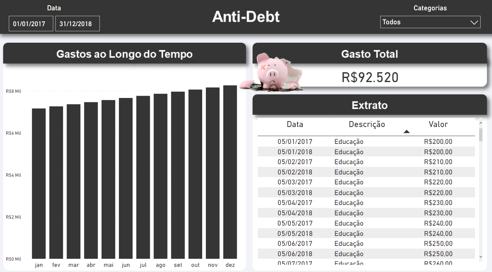

<h1 align="center">  
Anti-Debt
</h1>  

<h2 align="center">  
Project Status
</h2>

<h4 align="center">  
🚧 Developing 🚧  
</h4>  

 

 

## 📋 Table of contents
  
<!--ts-->  
 * [About](#💻-about)  
 * [Tools](#🛠-tools)
 * [Pre-requisites](#⚠️-pre-requisites)  
 * [How it works ](#🚀-how-it-works)  
 * [How to contribute](#💪-how-to-contribute)  
 * [Author](#🙋‍♂️-author)  
 * [License](#📝-license)  
<!--te-->  

 

## 💻 About

Anti-debt is a project to help people organize spending and avoid debts.

 
  
## 🛠 Tools
  
The following tools were used in the construction of the project:

* Power BI
* Excel

 

## ⚠️ Pre-requisites
  
For correct project execution, the following prerequisite must be attend:  

 - [x] Power BI Desktop
 - [x] Excel
 - [x] Follow <a href="https://github.com/chandreatti/anti-debt/blob/main/dashboard%20features/manuals/changing%20data%20source%20path.pdf">changing data source path</a>
  
 

## 🚀 How it works

 

## 💪 How to contribute  

1. Fork the project.
2. Create a new branch with your changes: `git checkout -b my-feature`
3. Save your changes and create a commit message telling you what you did: `git commit -m" feature: My new feature "`
4. Submit your changes: `git push origin my-feature` 

   

## 🙋‍♂️ Author   
  
Made by Caio Henrique 👋 [Get in Touch!](https://www.linkedin.com/in/caioandreatti/)  

  

## 📝 License
  
This project is under the license [MIT](./LICENSE).  
